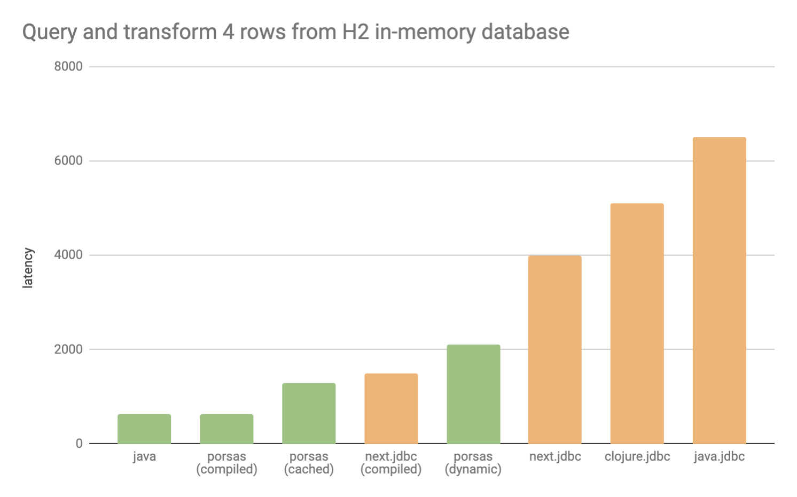

# porsas [](https://cljdoc.xyz/jump/release/metosin/porsas)


> Nopea kuin sika pakkasella

Spike to see how fast we can go with both Clojure + JDBC & Async SQL. Highly Experimental.

Related dicsussion: https://clojureverse.org/t/next-jdbc-early-access/4091

## Latest version

[](http://clojars.org/metosin/porsas)

## Basics

`porsas` provides tools for precompiling the functions to convert database results into Clojure values. This enables basically Java-fast database queries using idiomatic Clojure.

SQL queries are executed against a `Context`, which caches compiled row transformation functions based on database metadata.

There are different `Context` implementations:

* [JDBC](#JDBC), a standalone JDBC implementation
* [Async SQL](#AsyncSQL), non-blocking SQL access
* [jdbc.next](#), plugin for [`next.jdbc`](https://github.com/seancorfield/next-jdbc)

Currently, only eager `query-one` and `query` functions are supported.

## Performance

At least an order of magnitude faster than [`clojure.java.jdbc`](https://github.com/clojure/java.jdbc), see [the tests](https://github.com/metosin/porsas/blob/master/test/porsas/core_test.clj) for more details.



## Usage

### JDBC

With defaults:

```clj
(require '[porsas.jdbc])

(def ctx (jdbc/context))

(jdbc/query-one ctx connection ["select * from fruit where appearance = ?" "red"])
; {:ID 1, :NAME "Apple", :APPEARANCE "red", :COST 59, :GRADE 87.0}
```

Returning maps with qualified keys:

```clj
(def ctx
  (jdbc/context
    {:key (jdbc/qualified-key)}))

(jdbc/query-one ctx connection ["select * from fruit where appearance = ?" "red"])
; #:FRUIT{:ID 1, :NAME "Apple", :APPEARANCE "red", :COST 59, :GRADE 87.0}
```

Generate Records for each unique Resultset, with lowercased keys. NOTE: this feature uses runtime code generation, so it doesn't work under [GraalVM](https://www.graalvm.org/):

```clj
(def ctx
  (jdbc/context
    {:row (jdbc/rs->compiled-record)
     :key (jdbc/unqualified-key str/lower-case)}))

(jdbc/query-one ctx connection ["select * from fruit where appearance = ?" "red"])
; ; => #user.DBResult6208{:id 1, :name "Apple", :appearance "red", :cost 59, :grade 87.0}
```

`Context` can be omitted, bypassing all caching. Can be used when performance doesn't matter, e.g. when exploring in REPL:

```clj
(jdbc/query-one connection ["select * from fruit where appearance = ?" "red"])
; {:ID 1, :NAME "Apple", :APPEARANCE "red", :COST 59, :GRADE 87.0}
```

### Async SQL

Uses non-blocking [vertx-sql-client](https://github.com/eclipse-vertx/vertx-sql-client) and can be used with libraries like [Promesa](https://github.com/funcool/promesa) and [Manifold](https://github.com/ztellman/manifold).

```clj
(require '[porsas.async :as async])

(def ctx (async/context))

;; define a pool
(def pool
  (async/pool
    {:uri "postgresql://localhost:5432/hello_world"
     :user "benchmarkdbuser"
     :password "benchmarkdbpass"
     :size 16}))

(-> (async/query-one ctx pool ["SELECT randomnumber from WORLD where id=$1" 1])
    (async/then :randomnumber)
    (async/then println))
; prints 504
```

A blocking call:

```clj
(-> (async/query-one ctx pool ["SELECT randomnumber from WORLD where id=$1" 1])
    (async/then :randomnumber)
    (deref))
```

#### With Promesa

```clj
(require '[promesa.core :as p])

(-> (pa/query-one ctx pool ["SELECT randomnumber from WORLD where id=$1" 1])
    (p/chain :randomnumber println))
; #<Promise[~]>
; printls 504
```

#### With Manifold

```clj
(require '[manifold.deferred :as d])

(-> (pa/query-one ctx pool ["SELECT randomnumber from WORLD where id=$1" 1])
    (d/chain :randomnumber println))
; << … >>
; printls 504
```

### next.jdbc

Using porsas with `:builder-fn` option of `next.jdbc`:

```clj
(require '[porsas.next])
(require '[next.jdbc])

(def builder-fn (porsas.next/caching-row-builder))

(next.jdbc/execute-one! connection ["select * from fruit where appearance = ?" "red"] {:builder-fn builder-fn})
; #:FRUIT{:ID 1, :NAME "Apple", :APPEARANCE "red", :COST 59, :GRADE 87.0}
```

## More info

There is [#sql](https://clojurians.slack.com/messages/sql/) in [Clojurians Slack](http://clojurians.net/) for discussion & help. 

Roadmap as [issues](https://github.com/metosin/porsas/issues).

## License

Copyright © 2019 [Metosin Oy](http://www.metosin.fi)

Distributed under the Eclipse Public License, the same as Clojure.
